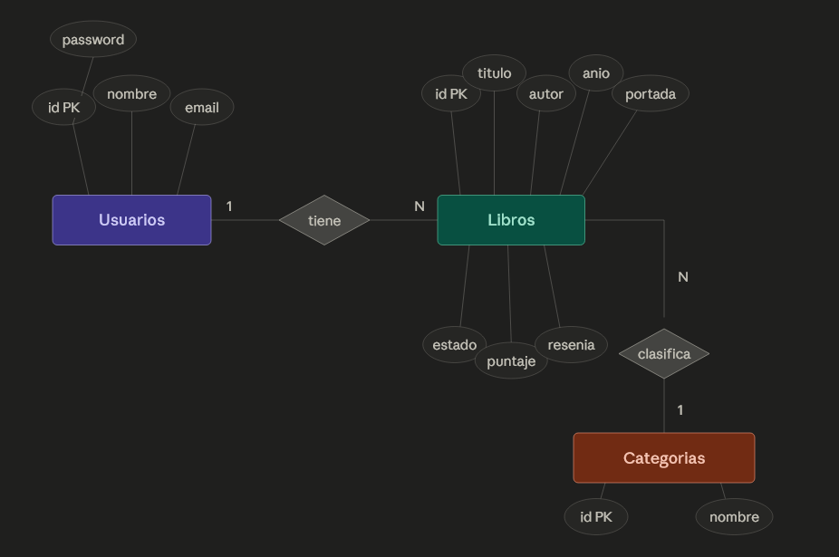

# Proyecto Final Grupo 6

Proyecto base para el trabajo final de Programacion 3. Es una aplicacion web completa con frontend, backend, base de datos y servicios auxiliares, todo orquestado con Docker Compose.

Link render: https://proyecto-final-prog3-g6.onrender.com/api


## 👥 Integrantes - Grupo 6

- Julieta Dabús
- Alejandro Lucas Baldres
- Julian Riedinger
- Marianela Belardinelli
- Clara Zivano
- Matías F. Ledesma González

## 📋 Organización

### División del Trabajo

#### Alejandro Lucas Baldres

**Entidad Libro**  
_Backend_

- Interfaces:
  1. Libro-interface: _Solo InterfaceLibro_
  2. dbConfig-interface
- Modelo Libro
- Manejador de Errores: error-libros-handler.middlerware.ts
- Seeder Libro
- Controlador Libro con los siguientes endpoints:
  1. GET /api/libros
  2. GET /api/libros/:id
  3. GET /api/libros/portada/:id
  4. POST /api/libros
  5. PUT /api/libros/:id
  6. DELETE /api/libros/:id
- Rutas:
  1. Asociadas a libros-controller
  2. Enrutador principal (index-router.ts)
- Refactorizacion a P.O.O e implementacion de TypeScript:
  1. App.ts
  2. Server.ts
  3. database.ts

#### Marianela Belardinelli

**Estado de lectura**  
_Backend_

- Interfaz agregada a Libro-interface.ts:
  1. IActualizarEstado
- Controlador bookStatusController.ts con los siguientes endpoints:
  1. GET /api/libros/leidos
  2. GET /api/libros/leyendo
  3. GET /api/libros/por-leer
  4. PATCH /api/libros/:id/estado — valida que el estado sea un valor del enum EstadoLectura (por leer, leyendo, leido)
- Rutas agregadas a libros-routes.ts

#### Julieta Dabús

**Califaciones y Relaciones FK**  
_Backend_

- Controlador calificacion-libros-controller.ts con los siguientes endpoints:

1. PATCH /api/libros/:id/calificacion — valida que sea entre 1 y 5
2. GET /api/libros/mejor-calificados — devuelve libros con puntaje asignado, ordenados de mayor a menor

- Rutas agregadas a libros-routes.ts
- Relaciones FK definidas mediante decoradores @ForeingKey y @BelongsTo en el modelo Libro.ts:
  - usuarioId -> @ForeingKey (() => Usuario)
  - generoId -> @ForeingKey (() => Categoria)
- Actualización de traerTodos y encontrarPorId para incluir Usuario y Categoria en la respuesta

#### Matías F. Ledesma González

- Sección estadísticas (Estadistica.interface.ts, estadisticas.utils.ts y estadisticas.controller.ts)
- Esta sección trabaja sobre la base de datos y devuelve un resumen con las siguientes variables (utils/estadisticas.utils.ts/Class Estadisticas):
  1. TotalLibros: devuelve el número cargado en la base de datos
  2. LibrosLeidos, LibrosLeyendo y LibrosPorLeer: devuelve el número de libros según cada estado
  3. LeidoReciente: devuelve el título del último libro que estemos leyendo, sino existiera devuelve "-"
  4. TerminadoReciente: devuelve el título del último libro terminado, sino existiera devuelve "-"
  5. UltimoIncorporado: devuleve el título del último libro incorporado, sino existiera devuelve "-"

- Función actualizarResenia()
Esta función dentro de libro.models.ts encuentra el libro por ID y actualiza el atributo reseña (string) c on la nueva información incorporada por el usuario.

#### Julián Riedinger

**Entidad Categorias**  
_Backend_

- Interfaz Categorias
- Modelo Categorias
- Manejador de Errores Global: error-handler.middleware.ts
- Manejador de Errores de Categoria
- Fix en Delete de Libros para manejar error particular
- Seeder Categorias
- Controlador Categorias con los siguientes endpoints:
  1. GET /api/categorias
  2. GET /api/categorias/:id
  3. POST /api/categorias
  4. DELETE /api/categorias/:id
- Rutas asociadas a categorias-controller


#### Clara Zivano
- Interfaz Usuario
- Modelo Usuario
- Seeder de Usuario (con 3 caso)
- Controlador Usuario con los siguientes endpoints:
  1. GET /api/usuarios
  2. GET /api/usuarios/:id
  3. POST /api/usuarios
  4. DELETE /api/usuarios/:id
- Router Usuarios


## Metodologías utilizadas

Esta sección define el flujo de trabajo y las convenciones de nomenclatura para la gestión de ramas en el proyecto, asegurando un historial limpio y una integración controlada a través de GitHub.

### Estructura de Ramas Principales

El proyecto se rige por dos ramas estables de larga duración:

- Main: Es la rama principal del proyecto. Contiene la versión lista para entregar, por lo que sólo debe recibir código que haya sido probado y aprobado.
- Dev: Es la rama de integración. Aquí se consolidan todas las funcionalidades y correcciones antes de pasar a la rama principal. Es el entorno de desarrollo activo.

### Convenciones para Ramas Personales

Cada integrante del grupo trabajará en ramas creadas a partir de Dev. El nombre de estas ramas debe seguir una estructura específica según el propósito de la tarea:

A. Nuevas Funcionalidades (Features) Si la tarea consiste en agregar una nueva característica o componente al proyecto:

- Formato: feature/agregado-Iniciales
- Ejemplo: feature/formulario-JD

B. Corrección de Errores (Fixes) Si la tarea consiste en solucionar un error o realizar un ajuste técnico:

- Formato: fix/correccion-Iniciales
- Ejemplo: fix/validaciones-JD

C. Documentación (Docs) Si la tarea consiste en generar o modificar documentación:

- Formato: docs/descripcion-Iniciales
- Ejemplo: docs/readme-ALL

## Resumen de Flujo de Trabajo

1. Estar posicionado en Dev y hacer un git pull para tener lo último.
2. Crear la rama personal: git checkout -b feature/mi-tarea-AB
3. Realizar los cambios y hacer commit.
4. Subir la rama al repositorio remoto: git push --set-upstream origin feature/mi-tarea-AB
5. Abrir el Pull Request en GitHub hacia la rama Dev.
6. Realizar el Merge a la rama Dev.
7. Una vez que el código de Dev esté estabilizado y listo para generar el entregable,
   realizar el Pull Request a Main.

## Documentación Técnica

## Arquitectura General

```
    (Por                (Por
implementar)        implementar)
┌─────────────┐    ┌─────────────┐    ┌─────────────┐
│   Caddy     │    │   React     │    │   Express   │
│  (Proxy)    │◄──►│ (Frontend)  │◄──►│  (Backend)  │
│   :80       │    │   :3000     │    │   :3001     │
└─────────────┘    └─────────────┘    └─────────────┘
                                              │
                                      ┌─────────────┐
                                      │ PostgreSQL  │
                                      │    (DB)     │
                                      │   :5432     │
                                      └─────────────┘
```

Todos los servicios corren dentro de contenedores Docker y se comunican a traves de una red interna (`app_network`). Caddy actua como reverse proxy: recibe todo el trafico en el puerto 80 y lo redirige al frontend o al backend segun la URL.

| Servicio     | Tecnologia                       | Puerto | Funcion                        |
| ------------ | -------------------------------- | ------ | ------------------------------ |
| **Frontend** | React 18                         | 3000   | Interfaz de usuario            |
| **Backend**  | Express + TypeScript + Sequelize | 3001   | API REST                       |
| **Database** | PostgreSQL 15                    | 5432   | Base de datos relacional       |
| **Proxy**    | Caddy 2                          | 80     | Reverse proxy                  |
| **pgAdmin**  | pgAdmin 4                        | 5050   | Administracion visual de la BD |

---

## Inicio Rapido

### Requisitos previos

- [Docker](https://docs.docker.com/get-docker/) y [Docker Compose](https://docs.docker.com/compose/install/) instalados.

### Levantar el proyecto

```bash
# Construir las imagenes (solo la primera vez o cuando cambien dependencias)
docker-compose build

# Iniciar todos los servicios
docker-compose up
```

Una vez que todo este corriendo, podes acceder a:

| Recurso          | URL                       |
| ---------------- | ------------------------- |
| Frontend (React) | http://localhost:3000     |
| Backend API      | http://localhost:3001/api |
| Proxy (Caddy)    | http://localhost          |
| pgAdmin          | http://localhost:5050     |

> **Tip:** Si queres correrlo en segundo plano, usa `docker-compose up -d`. Para ver los logs: `docker-compose logs -f`.

### Detener el proyecto

```bash
# Detener los servicios (mantiene los datos)
docker-compose down

# Detener y borrar todos los datos (base de datos, cache, etc.)
docker-compose down -v
```

---

## Estructura del Proyecto

```
proyecto/
├── docker-compose.yml              # Orquestacion de todos los servicios
├── .gitignore
├── README.md
│
├── backend/
│   ├── Dockerfile.dev               # Imagen Docker para desarrollo
│   ├── package.json
│   ├── app.ts                    # Punto de entrada del servidor Express
│   ├── config/
│   │   └── database.ts              # Config de conexion a PostgreSQL
│   ├── models/
│   │   ├── index.ts                 # Inicializa Sequelize y registra modelos
│   │   ├── categoria.model.ts
│   │   ├── estadisticas.model.ts
│   │   ├── usuario.model.ts
│   │   └── libro.model.ts                  
│   ├── controllers/
│   │   ├── calificaciones.libros.controller.ts
│   │   ├── categorias.controller.ts
│   │   ├── estadisticas.controller.ts
│   │   ├── estado.libro.controller.ts  
│   │   ├── usuarios.controller.ts
│   │   └── libros.controller.ts        
│   ├── middleware/
│   │   ├── error-handler.middleware.js 
│   │   ├── error-categorias-handler.middleware.ts
│   │   ├── error-usuarios-handler.middleware.ts
|   |   └── error-libros-handler.middleware.ts 
│   ├── routes/
│   │   ├── index.routes.ts          # Router principal
│   │   ├── categorias.routes.ts
│   │   ├── usuarios.routes.ts
│   │   └── libros.routes.ts         
│   ├── seeders/                     # Datos de prueba
│   │   ├── 20260614-seeder-usuarios.ts
│   │   ├── 20260605145618-categoria.ts
|   |   └── 20260606-seeder-libro.ts
│   ├── core/                     # Contenedor del Core de la API
|   |   └── server.ts
│   └── interfaces/
│       ├── dbConfig.interface.ts 
│       ├── categoria.interface.ts
│       ├── Estadistica.interface.ts
│       ├── Libro.interface.ts
│       └── Usuario.interface.ts    
│
└── frontend/
    └── TODO

```

## Diagrama Entidad-Relacion



## Tecnologias Utilizadas

### Backend

- **[Express](https://expressjs.com/)** — Framework web para Node.js
- **[Sequelize](https://sequelize.org/)** — ORM para bases de datos SQL
- **[TypeScript](https://www.typescriptlang.org/)** — JS Tipado
- **[cors](https://github.com/expressjs/cors)** — Configuracion de Cross-Origin Resource Sharing

### Infraestructura

- **[Docker](https://docs.docker.com/)** — Contenedores
- **[Docker Compose](https://docs.docker.com/compose/)** — Orquestacion multi-contenedor
- **[PostgreSQL 15](https://www.postgresql.org/docs/15/)** — Base de datos relacional
